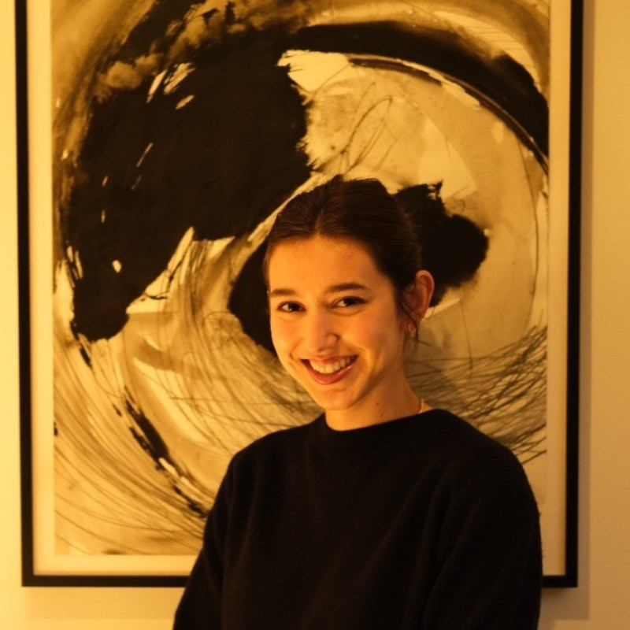

# Jülide Erdoğan #  Jülide Erdoğan

📍 Cologne, Germany
📧 juelide.erdogan@gmail.com  
📞 +49 17621130156  
🌐 [LinkedIn](https://www.linkedin.com/in/jülide-erdogan-0a3a0127b)  

---

## 🎓 Education

- **Heinrich Heine University** (Starting October 2024)  
  *Bachelor of Science in Psychology* – Düsseldorf, Germany  

- **Maastricht University** (September 2021 – August 2024)  
  *Bachelor of Science in Psychology* – Maastricht, Netherlands  
  **GPA**: 8.09/10.0 (Cum Laude)  

- **Flinders University** (July 2023 – January 2024)  
  *Exchange Program via MaRBLe Excellence Program* – Adelaide, Australia  

- **Johann Gottfried Herder Gymnasium** (September 2013 – July 2021)  
  *High School Diploma (Abitur)* – Cologne, Germany  
  **GPA**: 1.0/1.0  

---

## 🧠 Research Experience

### MaRBLe Excellence Program (July 2023 – July 2024)  
**Empirical Research for Bachelor Thesis** – Adelaide, Australia & Maastricht, Netherlands  
*Grade: 8.5/10*  
**Title:** “The Effect of Verbal Communication Deficits on Perceived Remorse, and Penalty Harshness in Individuals with Autism Spectrum Disorder (ASD)”  

- Designed and executed a research study investigating the impact of verbal communication deficits on perceived remorse and penalty harshness in individuals with ASD.  
- Conducted a critical literature review to derive hypotheses and statistical methodologies.  
- Applied Bayesian Inferential Statistics using R-Studio to analyze data from 202 participants.  
- Identified perceived remorse as a mediator between ASD diagnosis and penalty harshness, underscoring the disadvantages autistic individuals face in the justice system.  
- Managed the research timeline, coordinating literature review, data collection, analysis, and academic writing stages.  

---

## 💼 Professional Experience

### **Soziale Dienstleistungen Becker (SDB)** (March 2023 – Present)  
*Case Report Writer* – Cologne, Germany  

- Authored detailed case reports for clients with mental disorders to secure funding for outpatient care.  
- Analyzed client strengths, weaknesses, and needs through interviews and collaboration with outpatient carers.  
- Developed individualized rehabilitation plans with tailored goals and measures.  
- Evaluated progress and adjusted goals to ensure effective rehabilitation.  

### **Café Paulus** (February 2022 – March 2023)  
*Waitress* – Maastricht, Netherlands  

- Delivered high-quality customer service in a fast-paced environment.  
- Managed multiple tasks under pressure and maintained composure in stressful situations.  

---

## 🛠️ Skills

### Research and Technical Skills

- Data collection and analysis (SPSS)  
- Data output interpretation (SPSS/R-Studio)  
- EEG data analysis  
- Systematic literature review  
- Academic and technical writing  
- Psychiatric anamnesis and personality questionnaires  
- DSM-V & ICD-10 classifications  

### Software Proficiency

- Microsoft Excel, Word, and PowerPoint  
- SPSS  
- Qualtrics XM  
- Basic Python  

### Languages

- **English**: C1  
- **German**: Native  
- **Turkish**: Native  
- **Spanish**: B2  
- **Latin**: Proficiency Certificate  

---

## 🌟 Extracurricular Activities

- **STOKED Maastricht** (September 2021 – July 2023)  
  Member of the Student Association for Skiing and Snowboarding – Maastricht, Netherlands  

- Enthusiast in swimming, running, reading, and creative writing.  

---

*Thank you for visiting my portfolio! Feel free to connect with me on [LinkedIn](https://www.linkedin.com/in/jülide-erdogan-0a3a0127b).*
